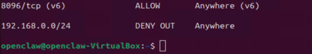
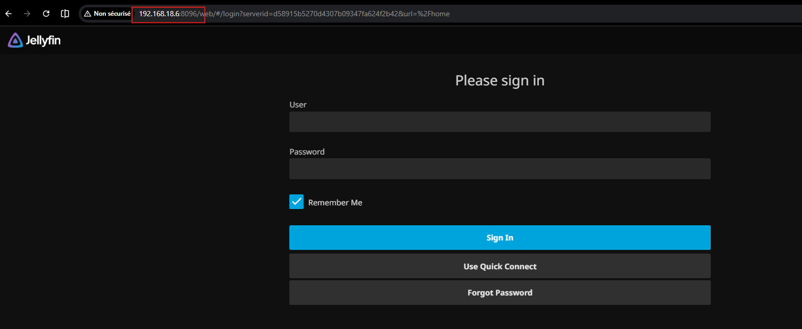

# Guide de Configuration : Serveur Média Jellyfin Sécurisé sur Ubuntu

Bonjour à tous et bienvenue dans ce guide. Si vous avez un ordinateur qui prend la poussière, ce guide est pour vous ! Nous allons installer une machine virtuelle sur cet ordinateur et le configurer comme serveur de streaming, un peu comme si vous hébergez votre propre Netflix à la maison.

## 1. Installation de la machine virtuelle Ubuntu

Commencez par installer un logiciel de virtualisation (Hyper-V ou Oracle VirtualBox). Pour ce guide, nous utiliserons VirtualBox.

1. Téléchargez la distribution Ubuntu. Vous avez le choix entre Ubuntu Server et Ubuntu Desktop. Pour ce guide, nous utiliserons **Ubuntu Desktop** pour profiter de l’interface graphique.
2. Créez une nouvelle machine virtuelle et configurez au moins **8 Go de RAM, 50 Go de disque virtuel et 3 processeurs (cores)**.
3. Installez Ubuntu sur cette machine avec votre fichier `.iso`.
4. **Réseau :** Changez le réseau de la machine virtuelle pour **Accès en pont (Bridged Adapter)** afin de contourner le pare-feu de l'hôte Windows.

## 2. Configuration du pare-feu sur Ubuntu (UFW)

Pour sécuriser notre machine virtuelle (puisqu'elle est en mode Bridge sur le réseau local), nous allons configurer le pare-feu UFW. 
Lancez le terminal et exécutez les commandes suivantes :

```bash
# Autorise le trafic entrant utilisé par Jellyfin
sudo ufw allow 8096/tcp

# Bloque le trafic sortant vers notre réseau local pour empêcher les mouvements latéraux (Remplacez par votre sous-réseau)
sudo ufw deny out to 192.168.18.0/24

# Activer le pare-feu
sudo ufw enable

# Confirmer que les règles sont actives
sudo ufw status

```


3. Dossiers médias et permissions
Nous allons créer les dossiers pour nos médias et les sécuriser en dehors du répertoire utilisateur principal.

```bash
# Création des répertoires
sudo mkdir -p /srv/media/movies
sudo mkdir -p /srv/media/series

# Configuration des permissions (Pour nous définir comme propriétaire et Jellyfin comme groupe)
sudo chown -R $USER:jellyfin /srv/media

# Restreint l’accès total pour nous, lecture seule pour Jellyfin, et bloque le reste
sudo chmod -R 750 /srv/media
```

4. Installation de Jellyfin
Exécutez les commandes suivantes dans le terminal pour installer le service :

```bash
# Télécharge et installe le serveur média depuis le dépôt officiel
curl [https://repo.jellyfin.org/install.sh](https://repo.jellyfin.org/install.sh) | sudo bash

# Confirmer que le service est en cours d'exécution (Appuyez sur 'q' pour quitter)
sudo systemctl status jellyfin

```
À partir de votre navigateur, visitez http://localhost:8096 pour créer un compte admin et pointer vos bibliothèques vers les dossiers que nous avons créés (/srv/media/movies et /srv/media/series).


5. Accès à distance Zero-Trust (Tailscale)
Pour pouvoir accéder à notre serveur en dehors de notre réseau local, nous utiliserons Tailscale. Cela crée un tunnel sécurisé (WireGuard) qui contourne le CGNAT de votre fournisseur d'accès et vous évite d'ouvrir des ports sur votre routeur (Port Forwarding).

Installation
```bash
curl -fsSL [https://tailscale.com/install.sh](https://tailscale.com/install.sh) | sh
Authentifier la machine

sudo tailscale up
(Cliquez sur le lien généré dans le terminal pour approuver la machine dans votre compte Tailscale).

Vous pourrez désormais accéder à votre serveur Jellyfin de n'importe où avec l’adresse IP Tailscale de la machine virtuelle.

[Insérer l'image du dashboard Tailscale ici]
```

Pour tester : Installez Tailscale et l’application Jellyfin sur votre cellulaire, désactivez le Wi-Fi, puis testez Jellyfin en vous connectant sur l’adresse IP Tailscale : http://100.x.x.x:8096.

[Insérer les images de l'application mobile ici]

Partage externe (Node Sharing) : Pour donner accès à d’autres utilisateurs (comme de la famille ou des amis), vous pouvez partager uniquement la machine virtuelle Ubuntu à partir de la console Tailscale en cliquant sur les trois points ("Share"), sans leur donner accès au reste de votre réseau.

[Insérer l'image du bouton Share Tailscale ici]

6. Accès local (Smart TV)
Les appareils sur le même réseau (ex: Smart TV dans le salon) n'ont pas besoin de Tailscale. Ils peuvent se connecter directement avec l'adresse IP locale assignée par le routeur à la VM en mode Bridge.

Adresse de connexion : http://192.168.18.X:8096 (utilisez la commande ip a dans le terminal pour vérifier votre IP locale).
